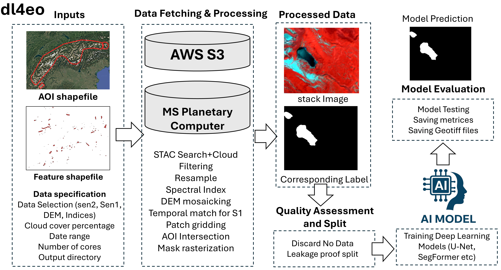

# Summary

Deep learning has become central to Earth observation (EO), enabling large-scale
mapping of surface features such as water bodies, glaciers, floods, forests, and
built-up areas [@zhu2017; @ma2019]. Building a custom EO segmentation model,
however, remains a fragmented engineering effort: satellite imagery must be
acquired from multiple sensors, co-registered and resampled to a common grid,
tiled into patches, quality-screened, split into training and evaluation sets
without leakage, normalized, passed to a training loop, and finally exported as
georeferenced predictions. Each step is typically re-implemented for every new
project.

`dl4eo` is a Python package that provides this entire workflow from raw
satellite data to an evaluated, georeferenced segmentation model through a
small number of high-level function calls, without requiring API credentials or
manual environment configuration. It automatically retrieves and spatially
aligns Sentinel-2 Level-2A optical imagery, Sentinel-1 radiometrically
terrain-corrected (RTC) SAR, and Copernicus DEM elevation data, and produces
analysis-ready image–label patches (by default 256 × 256 px with ten bands:
Blue, Green, Red, NIR, Red-edge, SWIR, a spectral index, Elevation, and SAR VV
and VH). Beyond data preparation, `dl4eo` adds patch-level quality control,
leakage-aware train/validation/test splitting, single-interface training of
twelve segmentation architectures, and standardized evaluation that reports
per-class metrics and writes predictions as GeoTIFFs in the original coordinate
reference system. `dl4eo` (v0.5.1) is released under the MIT License on the
Python Package Index (`pip install dl4eo`).

# Statement of need

The combination of openly available satellite data, accessible compute, and
mature deep-learning libraries has made EO segmentation feasible across nearly
every application domain, from flood mapping [@bonafilia2020] to glacial-lake
monitoring [@kaushik2022]. Adoption by the broader EO community, and
particularly by domain scientists without deep software-engineering experience,
is nonetheless constrained by the data-engineering work that precedes any model.
Practitioners must navigate multiple data-access APIs, handle multi-sensor
alignment and resampling, rasterize vector labels into pixel-accurate masks,
construct train/validation/test partitions that avoid spatial and temporal
leakage, apply normalization without contaminating held-out data, configure a
segmentation architecture, and produce spatially referenced outputs. Each step
is non-trivial, frequently undocumented, and commonly rebuilt from scratch.

`dl4eo` targets Earth scientists and EO practitioners who have a labelled vector
file and a study area but limited time to build this scaffolding. By
standardizing the workflow, the package lets a researcher move from a labelled
shapefile to a quantitatively evaluated, georeferenced prediction map within a
single session, using only a feature shapefile, an area-of-interest polygon, and
a date range as input.

# State of the field

Existing open-source tools address fragments of this workflow. `torchgeo`
[@stewart2022] provides geospatially aware PyTorch datasets and curated
benchmarks but does not handle multi-sensor acquisition, label-guided patch
selection, or training pipelines. `geoai` [@wu2023] offers geospatial-AI
utilities built on `torchgeo` and `samgeo`, with a focus on foundation-model
fine-tuning, but does not provide automated SpatioTemporal Asset Catalog (STAC)
download, Sentinel-1/DEM integration, or standardized evaluation. `eo-learn`
[@eolearn] supports pipeline orchestration via the Sentinel Hub API but does not
include deep-learning training. `dl4eo` is, to our knowledge, the first package
to combine credential-free multi-sensor acquisition, leakage-aware dataset
construction, multi-architecture training, and georeferenced evaluation in a
single coherent interface (Table 1).

Table: Comparison of `dl4eo` with related EO software.

| Capability | `dl4eo` | `torchgeo` | `geoai` | `eo-learn` |
|---|:---:|:---:|:---:|:---:|
| Automated multi-sensor download (S2, S1, DEM) | yes | no | no | partial |
| Label-guided patch selection | yes | no | no | no |
| Quality control / nodata screening | yes | no | no | yes |
| Leakage-aware train/val/test split | yes | no | no | no |
| Multi-architecture training | yes | no | partial | no |
| Standardized per-class evaluation | yes | no | no | no |
| CRS-preserving GeoTIFF prediction export | yes | no | no | no |

# Software design

`dl4eo` is organized around user-friendliness for domain experts: the full
pipeline from acquisition to evaluation is driven by a handful of high-level
calls, with detailed function signatures and usage examples kept in the package
documentation rather than reproduced here. Three design choices are central.

*Leakage-aware learning.* Two forms of leakage are addressed by default. First,
per-band normalization statistics are computed exclusively from the training
split and applied to held-out patches at load time, avoiding the inflation of
validation accuracy that results when statistics are computed globally. Second,
in addition to a random baseline, the package offers temporal and spatial split
strategies that assign patches from different acquisition dates or different
Sentinel-2 tiles to different partitions, reducing the autocorrelation-driven
leakage common in raster-derived EO datasets [@russwurm2020; @jean2019].

*Label-guided patch selection.* When tiling a scene, only grid cells that
intersect at least one label polygon are retained. For rare features, a
Himalayan glacial-lake scene may contain lake pixels in well under 3% of naively
generated patches, this removes the need for background-ratio sampling and
substantially reduces storage.

*Lightweight by default.* A bare `import dl4eo` does not import PyTorch, allowing
the data pipeline to run in CPU-only environments; the training and evaluation
stack is installed only via the optional extra (`pip install dl4eo[train]`).
Twelve architectures, encoder–decoder models (UNet, UNet++, DeepLabV3+, FPN,
PSPNet, LinkNet, PAN, MA-Net) [@unet; @deeplabv3plus; @fpn], a SegFormer-style
model [@segformer], and Vision Transformer variants — are exposed through one
training interface and one evaluation interface, enabling rapid multi-model
comparison on any custom EO segmentation task. The encoder–decoder models build
on Segmentation Models PyTorch [@smp] and `timm` encoders [@timm], and training
is orchestrated with PyTorch Lightning [@lightning]. Evaluation reports per-class
IoU, F1, Precision, Recall, Overall Accuracy, and Cohen's Kappa, and writes each
prediction as a single-band GeoTIFF carrying the exact CRS and affine transform
of its source patch, so outputs overlay directly in QGIS or ArcGIS. A schematic
of the workflow is shown in Figure 1.

# Research impact

`dl4eo` lowers the barrier to applying modern segmentation models to new EO
problems by removing the data-engineering work that usually precedes
experimentation. Its patch outputs (multi-sensor, normalized, labelled) are also
directly compatible with geospatial foundation-model fine-tuning workflows such
as Prithvi [@prithvi] and SatMAE [@satmae], allowing the package to serve as a
dataset-preparation backend before adapting a large pretrained model to a
downstream task. The package has been used to construct multi-sensor training
data for glacial-lake and cryosphere segmentation research at the authors'
institution and is applicable to any globally distributed Earth-surface feature
for which vector labels exist.

# AI usage disclosure

Claude Sonnet 4.8 is used for language editing and code-debugging.

# Acknowledgements

This work was funded by the NASA Terrestrial Hydrology Program (award number:
80NSSC21K1341). The authors thank the University of Wisconsin–Madison Center for
High Throughput Computing for computational resources.

# References
